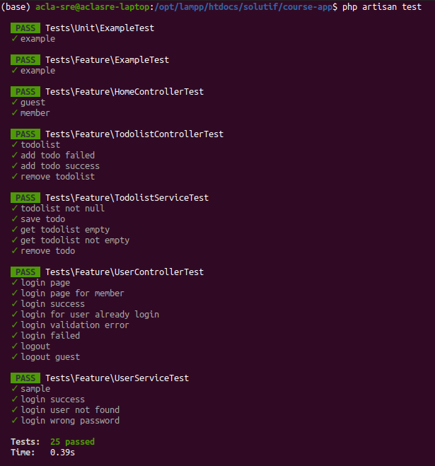

```bash
php artisan test
```


run specific method
```bash
php artisan test --filter methodName path/to/file.php
```
or (example for ExampleTest class and test_the_application_returns_a_successful_response method)
```bash
php artisan test --filter 'Feature\\ExampleTest::test_the_application_returns_a_successful_response'
```
